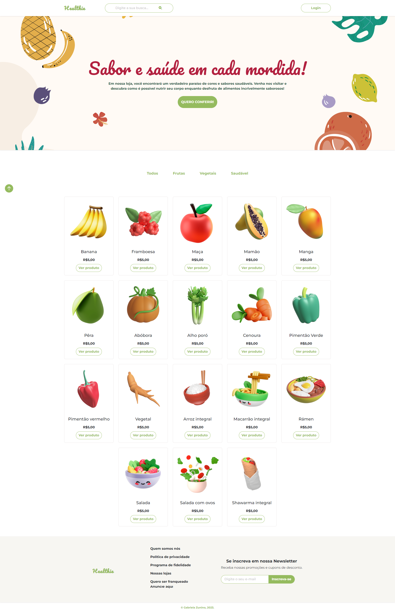

# Healtie E-commerce

Esse projeto foi criado para o Challenge AluraGeek E-commerce do projeto ONE + Alura.
Inicialmente, o layout proposto é outro, mas eu decidi criar o meu próprio layout e
também mudar o tema da loja.

Alguns objetivos do projeto eram:

- Reproduzir o layout proposto. (eu optei por criar um do zero.)
- Página principal, com apresentação dos produtos.
- Página de Login.
- Funcionalidade para adicionar, editar e remover produtos.
- Responsividade.
- Validação de formulários.
- Criação da API fake para armazenar os dados dos produtos e ser consumido quando necessário.
- Além disso, como extra poderíamos desenvolver a página dos produtos.

## 🚀 Começando

Para visualizar o site ao vivo é só clicar nesse link -> https://healthie-one.netlify.app/

A API foi "criada/hospedada" no mockApi.io

## 🛠️ Construído com

- HTML & CSS
- Bootstrap 5
- JavaScript

## 📷 Screenshots do projeto

.png)
.png)
.png)
---
⌨️ com ❤️ por [Gabriela Zunino](https://github.com/gaberelaa)